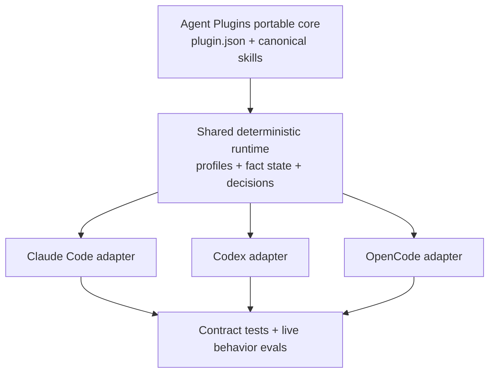

# Ultra Instinct v2 Runtime

## Goal

Ultra Instinct becomes a small, opinionated workflow runtime that reliably guides coding agents through the right skill before they act. It supports Claude Code, Codex, and OpenCode as first-class clients without growing into an ECC-sized agent operating system.

## Context

Ultra Instinct currently ships ten Agent Skills and deliberately has no plugin manifest, lifecycle hooks, session bootstrap, runtime state, or behavior test suite. That keeps installation simple, but skill selection depends entirely on the model noticing the right description at the right time. The repository does not currently validate as a Claude Code plugin because it has no Claude plugin manifest.

Superpowers demonstrates the missing lifecycle pattern: one canonical skill library, a small client adapter, session bootstrap, compaction recovery, and behavior-level acceptance tests. ECC demonstrates how to keep shared runtime logic, install profiles, manifests, commands, agents, and client adapters separate. Ultra Instinct will adopt those architectural patterns while retaining its smaller workflow and lower context cost.

Agent Plugins 1.0 is the portable packaging floor. It standardizes a root `plugin.json`, skills under `skills/`, and optional MCP configuration. It does not standardize hooks, commands, agents, runtime state, or completion gates, so those remain thin client-specific adapters over one shared runtime.

## Requirements

1. The plugin MUST conform to Agent Plugins 1.0 with a root `plugin.json` and the existing `skills/` directory as the portable core.
2. Claude Code, Codex, and OpenCode MUST each support native installation, native skill discovery, session bootstrap, compaction recovery, mutation tracking, verification tracking, and completion guidance.
3. All clients MUST load the same files under `skills/`; copied or translated skill directories are forbidden.
4. Client adapters MUST normalize native lifecycle events into one versioned runtime event contract. Workflow policy MUST NOT be reimplemented inside adapters.
5. The default profile MUST be `guided`. Users MAY select `lite` or `strict` through `ULTRA_INSTINCT_PROFILE`. Any missing value resolves to `guided`; an invalid value emits one warning and resolves to `guided`.
6. `lite` MUST preserve the current skill-only experience. `guided` MUST add context and warnings without denying an action. `strict` MUST add one bounded completion intervention for each unverified mutation cycle.
7. The bootstrap MUST tell the agent to select and load a matching skill before acting, preserve direct user and repository instructions as higher priority, and remain at or below 2,400 UTF-8 bytes after frontmatter is removed.
8. The runtime MUST restore the bootstrap after context compaction and include only machine-observed state: whether changes were made and whether fresh verification followed them.
9. The runtime MUST NOT store prompts, transcripts, tool arguments, tool output, source text, filenames, environment values, or credentials.
10. Hooks MUST NOT make network requests, install dependencies, modify project files, run tests automatically, or make subjective product decisions.
11. A runtime or state error MUST fail open in every profile, preserve the client action, and emit one concise warning. Methodology enforcement MUST never make the client unusable.
12. User instructions MUST win. If the user explicitly requests a different workflow, Ultra Instinct MAY warn about an objective risk but MUST NOT silently override the request.
13. The initial v2 catalog MUST contain exactly thirteen canonical skills: the existing ten plus `systematic-debugging`, `verification-before-completion`, and `receiving-code-review`.
14. Claude Code and OpenCode MUST expose explicit workflow commands and reviewer/debugger agents through their native plugin surfaces. Codex MUST expose equivalent workflows through skills and runtime guidance until portable plugin commands and agents are supported. Core acceptance MUST NOT depend on commands or agents.
15. The existing `npx skills add xsirix/ultra-instinct` installation MUST continue to work as the `lite` experience.
16. Any copied or modified Superpowers or ECC code MUST retain its MIT attribution. Claude Code implementation code MUST NOT be copied; only its documented plugin interfaces and public examples may shape compatibility behavior.
17. Release acceptance MUST measure real client behavior, not only manifest validity or file presence.

## Design

### Architecture

The repository has four layers:

1. **Portable core** — Agent Plugins metadata and the canonical skills.
2. **Shared runtime** — deterministic routing context, profile resolution, fact tracking, verification classification, and completion decisions.
3. **Client adapters** — event translation and client-native output only.
4. **Evaluation harness** — contract tests, package validation, and live behavior scenarios.

The planned package shape is:

```text
plugin.json
skills/
runtime/
hooks/
.claude-plugin/
.codex-plugin/
.opencode/
tests/
```

The root `plugin.json` is the canonical public metadata. Compatibility manifests contain only fields required by their client. Automated parity checks MUST reject mismatched name, version, license, repository, or skill root values.

No MCP server is required for v2. Hooks and the OpenCode plugin import or execute the bundled runtime directly.

### Shared runtime contract

Every adapter converts its native input into an `ultra.runtime-event.v1` event with:

- client: `claude`, `codex`, or `opencode`
- lifecycle stage
- session identifier
- workspace identity
- selected profile
- normalized tool category when applicable
- success or failure when applicable

Supported lifecycle stages are:

- `session.start`
- `context.compacting`
- `tool.before`
- `tool.after`
- `session.completing`
- `session.end`

The runtime returns a client-neutral decision containing zero or one context message, an optional allow/block decision, and a state update. Adapters convert that result into their native JSON, SDK mutation, log, toast, or continuation call.

The runtime is plain JavaScript compatible with Node.js and Bun and has no production dependencies. Adapters supply the plugin root explicitly; the runtime MUST NOT scan home directories, package caches, or marketplace directories to discover itself.

### Runtime state

State contains only deterministic facts needed across hook calls:

```json
{
  "schemaVersion": 1,
  "mutationEpoch": 0,
  "lastMutationAt": null,
  "lastVerificationAt": null,
  "verificationKind": null,
  "firstMutationReminderSent": false,
  "gateIssuedForEpoch": null
}
```

A successful native file mutation increments `mutationEpoch` and clears the current verification. Conservative client-neutral classifiers MAY recognize common shell-based mutation and verification commands, but uncertain commands MUST remain unclassified.

A verification is fresh only when a recognized verification command finishes successfully after the latest mutation. Recognized families include package-manager `test`, `check`, `typecheck`, `lint`, and `build` scripts plus common direct runners such as `pytest`, `cargo test`, `go test`, `dotnet test`, `mvn verify`, `gradle test`, `swift test`, `xcodebuild test`, `make test`, and `git diff --check`. The classifier stores only the verification family and timestamp, never the original command.

State files live under `ULTRA_INSTINCT_STATE_DIR` when set and otherwise under the operating system temporary directory in `ultra-instinct-runtime/`. The directory uses owner-only permissions where the operating system supports them. Filenames are hashes of client, session, and workspace identity. State is removed on a normal session end and entries older than seven days are discarded on startup. A corrupt or unsupported state file is ignored and replaced.

### Profiles

| Behavior | `lite` | `guided` | `strict` |
|---|---:|---:|---:|
| Native skills | Yes | Yes | Yes |
| Session bootstrap | No | Yes | Yes |
| Compaction recovery | No | Yes | Yes |
| First-mutation workflow reminder | No | Context only | Context only |
| Mutation and verification tracking | No | Yes | Yes |
| Unverified-completion warning | No | Yes | Yes |
| Completion intervention | No | No | Once per mutation epoch |

The first-mutation reminder is emitted once per session. It asks the agent to use TDD for behavior changes, systematic debugging for unexplained failures, and brainstorming only when the intended behavior is unsettled. It does not block the mutation.

In `strict`, an unverified completion is interrupted once for the current `mutationEpoch`. The context explains that files changed after the latest recognized verification and asks the agent to run appropriate checks or clearly explain why none apply. A second completion attempt for the same epoch is allowed with a warning, preventing hook loops. A later mutation starts a new epoch and permits one new intervention.

### Bootstrap and routing

The body of `skills/using-ultra-instinct/SKILL.md` is the canonical bootstrap. The runtime strips its frontmatter and injects the body. This prevents a separate bootstrap prompt from drifting away from the skill users load explicitly.

The body MUST remain a compact router rather than embedding the full skill catalog. It defines these routes:

- Unsettled goal or approach → `brainstorm`
- Visual product decision → `mockup`
- Agreed design → `write-design-spec`
- Approved spec → `write-plan`
- Approved plan → `execute-plan`
- Behavior change → `tdd`
- Unexplained failure → `systematic-debugging`
- Completed change → `verification-before-completion`
- Review requested or received → `request-review` or `receiving-code-review`
- Reviewed branch → `finish-branch`

The bootstrap MUST include a stable deduplication marker. Adapters MUST ensure the marker appears at most once in the active context supplied by that adapter.

### Client mappings

| Runtime stage | Claude Code | Codex | OpenCode |
|---|---|---|---|
| `session.start` | `SessionStart` | `SessionStart` | `config` skill registration plus `experimental.chat.messages.transform` |
| `context.compacting` | compact/clear `SessionStart` and compaction lifecycle | compaction lifecycle and restarted `SessionStart` | `experimental.session.compacting` appends Ultra state to `output.context` |
| `tool.before` | `PreToolUse` | `PreToolUse` | `tool.execute.before` |
| `tool.after` | `PostToolUse` and failure event | `PostToolUse` | `tool.execute.after` plus `file.edited` when available |
| `session.completing` | `Stop` | `Stop` | `session.idle` |
| `session.end` | `SessionEnd` | `SessionEnd` | `session.deleted` |

Claude Code and Codex use native additional-context and Stop-decision payloads. Both adapters guard against active Stop-hook recursion.

OpenCode registers the canonical `skills/` path through its config hook. Its message transform prepends the bootstrap to the first user message and checks the deduplication marker because the transform may run more than once. On strict unverified completion, the first `session.idle` event uses the OpenCode SDK `session.prompt` operation to request one continuation. The epoch guard prevents a continuation loop. If the SDK call fails, OpenCode logs a warning and leaves the session idle.

### Commands and agents

Where supported, client-native commands expose six explicit entry points:

- brainstorm
- design-spec
- plan
- execute
- verify
- finish

Commands load the corresponding canonical skill; they do not contain copied workflow instructions.

Claude Code and OpenCode also expose two specialist agents:

- **reviewer** — performs one whole-branch review using `request-review`
- **debugger** — investigates a failure using `systematic-debugging`

Agent definitions may translate tool names and isolation features for their client, but their methodology remains in the canonical skill. Missing command or agent support MUST NOT prevent manual or automatic skill use.

### Packaging and installation

The package supports two intentionally different installation modes:

- **Skills-only:** the existing Skills CLI command installs `skills/` and behaves as `lite`.
- **Runtime plugin:** each supported client installs the repository through its native plugin mechanism and defaults to `guided`.

Claude Code receives a valid marketplace and plugin manifest. Codex receives the Agent Plugins root manifest plus a `.codex-plugin` compatibility manifest while the released client surface transitions to the shared standard. OpenCode loads a published JavaScript entry point from the Git repository through its `plugin` configuration and automatically registers the canonical skill directory.

The runtime package MUST contain no postinstall script. After the client has installed or resolved the plugin package, Ultra Instinct hooks MUST NOT initiate network downloads during client startup or lifecycle events.

### Failure handling and safety

- Missing skill or bootstrap file: emit one warning and allow the client action.
- Invalid profile: warn once and use `guided`.
- Missing session identifier: use an in-memory session and disable persistent state for that session.
- State permission or parse failure: use in-memory state and continue.
- Unsupported native event: report the degraded capability during plugin load and keep supported capabilities active.
- Hook timeout or exception: fail open and include the adapter name in the warning.
- OpenCode continuation failure: warn and do not retry automatically.

Hook output MUST remain valid for its client even when the runtime fails. Logs MUST never include raw hook input.

### Verification and release gates

The evaluation harness has four layers:

1. **Static validation** — Agent Plugins schema, Claude marketplace validation, Codex manifest validation, OpenCode config loading, skill frontmatter, bootstrap byte budget, and metadata parity.
2. **Runtime contract tests** — profile resolution, state transitions, command classification, deduplication, corrupt-state recovery, bounded completion behavior, and fail-open errors.
3. **Adapter fixtures** — recorded native event payloads prove correct input normalization and output encoding for every supported event.
4. **Live behavior evaluations** — real sessions in Claude Code, Codex, and OpenCode prove that the behavior happens in the model, including after compaction.

The live suite MUST include positive and negative scenarios:

- A new feature selects brainstorming before mutation.
- A clear small behavior change selects TDD without unnecessary design ceremony.
- An unexplained failure selects systematic debugging.
- A typo-only edit does not force brainstorming or a design artifact.
- A read-only explanation does not enter an implementation workflow.
- Compaction preserves routing and stale-verification state.
- Guided mode warns but completes without fresh verification.
- Strict mode intervenes once, then accepts successful fresh verification.
- Strict mode cannot loop forever when no recognized verification applies.

Correct routing means the matching skill is loaded or explicitly announced before the first mutating tool call. Each routing scenario runs five times per client. Every positive scenario MUST pass at least four of five runs, positive routing MUST reach at least 90% overall, and false-positive routing MUST remain at or below 10% overall.

The current skills-only behavior is measured with the same prompt set before enabling runtime hooks. Guided mode MUST reach the routing thresholds above and improve over the baseline. When the baseline is below 70%, the improvement MUST be at least 20 percentage points. False-positive routing MUST NOT increase by more than five percentage points. Deterministic static, runtime, and adapter suites MUST pass 100%.

A release report records client versions, operating system, model, profile, scenario results, and failure signatures. Manifest validation or unit tests alone do not qualify the runtime for release.

## Constraints

- Agent Plugins schema: 1.0.0.
- Initial validated clients: Claude Code 2.1.227 or newer, Codex CLI 0.147.0 or newer, and OpenCode 1.18.15 or newer.
- Initial supported operating systems: macOS 14 or newer and Ubuntu 24.04 LTS. Windows may use skills-only mode but is not runtime-supported until it passes the same contract and live smoke gates.
- Runtime: plain ECMAScript modules compatible with Node.js 20 or newer and Bun 1.3 or newer.
- Production runtime dependencies: zero.
- Bootstrap body: at most 2,400 UTF-8 bytes.
- Persisted state: at most 4 KiB per active session.
- Hook runtime budget: 50 ms p95 in fixture tests and a hard client timeout of two seconds.
- Network access during hook execution: none.
- Default profile: `guided`.
- Skill count in the initial v2 release: thirteen.
- Repository license: MIT, with third-party attribution retained when code is reused.

## References

- Existing Ultra Instinct behavior: [`README.md`](../../../README.md) and [`skills/using-ultra-instinct/SKILL.md`](../../../skills/using-ultra-instinct/SKILL.md), commit `43d3f3532c499f1beffd7b12517a027cc3c34727`.
- [Superpowers porting guide](https://github.com/obra/superpowers/blob/44c9b2d6e889982ac18c27d05a19fefe335194e1/docs/porting-to-a-new-harness.md) — v6.2.0 lifecycle and adapter patterns.
- [Superpowers OpenCode adapter](https://github.com/obra/superpowers/blob/44c9b2d6e889982ac18c27d05a19fefe335194e1/.opencode/plugins/superpowers.js) — skill registration, bootstrap injection, and deduplication pattern.
- [Everything Claude Code](https://github.com/affaan-m/everything-claude-code/tree/569b1d5b32ebf4c32d0b965bb956b16713533e07) — v2.2.0 shared runtime, install profiles, hook controls, adapters, and validation patterns.
- [ECC cross-harness architecture](https://github.com/affaan-m/everything-claude-code/blob/569b1d5b32ebf4c32d0b965bb956b16713533e07/docs/architecture/cross-harness.md) — canonical source with harness-specific edges.
- [Agent Plugins 1.0 specification](https://agent-plugins.org/specification) and [pinned source](https://github.com/agentplugins/agent-plugins-spec/blob/bd383552095128f6effe895b9257cfd580a6d179/spec/1.0.0.md) — portable manifest, component discovery, environment, and extension boundaries.
- [Claude Code plugin reference](https://code.claude.com/docs/en/plugins-reference) and [hooks reference](https://code.claude.com/docs/en/hooks) — plugin layout and lifecycle payloads, verified 2026-08-12.
- [Codex plugin guide](https://learn.chatgpt.com/docs/build-plugins) and [hooks reference](https://learn.chatgpt.com/docs/hooks) — current plugin and lifecycle behavior, verified 2026-08-12.
- [Codex plugin namespace implementation](https://github.com/openai/codex/blob/eb752e43d9b7bd7dc5965ea20642bcf7f1a492d8/codex-rs/utils/plugins/src/plugin_namespace.rs) — root Agent Plugins manifest plus compatibility-manifest discovery.
- [OpenCode plugin reference](https://opencode.ai/docs/plugins/) and [SDK reference](https://opencode.ai/docs/sdk/) — plugin events, compaction context, and session continuation API, verified 2026-08-12 against OpenCode 1.18.15.
- [Claude Code public repository license](https://github.com/anthropics/claude-code/blob/681a8be245e7759a405e276b16ae69ea6b75076f/LICENSE.md) — public repository material remains Anthropic-owned and is used as API reference only.

## Visuals



The portable core owns methodology, the runtime owns policy, and adapters only translate lifecycle events. This is the smallest boundary that prevents three client implementations from drifting.

## Out of scope

- An ECC-sized general-purpose skill catalog.
- Long-term memory, continuous learning, instinct extraction, or transcript mining.
- A control plane, dashboard, remote service, telemetry, or analytics.
- Bundled MCP servers.
- Automatic dependency installation or automatic project test execution.
- Semantic task classification through an additional model call.
- Cursor, Gemini CLI, Pi, or other runtime adapters in the initial v2 release; the existing Skills CLI installation remains available to them.
- Windows runtime support in the initial release.
- A graphical installer, registry, updater, or doctor command.

## Open questions

None. The design defaults to the `guided` profile, treats `strict` as an explicit opt-in, and defines degraded behavior where a client cannot honor an event.
